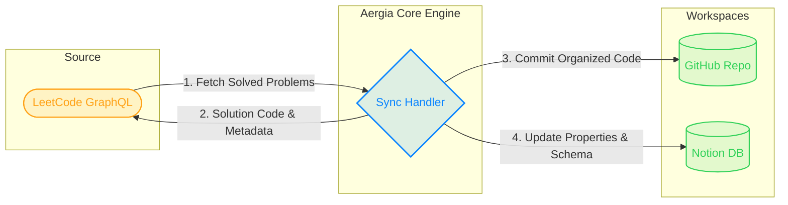

# ✦ Aergia Engine

> A premium, intelligent developer automation pipeline. Aergia automatically monitors your solved LeetCode solutions, processes them through an intelligent pipeline, commits organized solutions to GitHub, and registers rich metadata inside Notion databases.

<p align="left">
  <a href="https://aergia-one.vercel.app/"></a>
  
  
  
  
  
</p>

---

## 📐 Architecture & Flow

Aergia coordinates transactions between several platforms to ensure your portfolio stays synchronized in real time:



---

## ✨ Key Capabilities

### 🎨 Premium Translucent Interface (iOS 18 Grid Aesthetic)
*   **Frosted Glassmorphism:** Custom components styled with light-refracting double-borders simulating native macOS/iOS window panels.
*   **Micro-Interactions:** Hover states trigger interactive scanning glows (`#FF9FFC`) and coordinate readouts.
*   **Ambient Mesh Overlay:** A minimal mathematical vector grid is layered dynamically over the background.

### 🌌 Interactive 3D WebGL Scanner
*   **Three.js Shader Grid:** Renders an interactive WebGL coordinate mesh that skews and responds to user focus.
*   **Device-Aware Ingestion:** Translates desktop cursor or mobile gyroscope movement to control 3D viewport orientation.
*   **Cinematic Entrance:** Staggered character blur-to-focus transition hooks built on top of Framer Motion.

### ⚡ Unified Sync Pipeline
*   **Dual Target Synced Actions:** Instantly backs up solved problems onto GitHub while registering details in Notion databases.
*   **Automated Notion Database Provisioning:** Configures missing table schemas (time/space complexity, pattern labels, difficulty) using a single endpoint trigger.
*   **Intuitive Setup Chat:** Interactive chatbot onboarding console that preserves configuration properties locally in the client storage.

---

## 🛠️ Technology Stack

*   **Frontend Core:** React 19, TypeScript, Three.js, postprocessing, Tailwind CSS, Motion (framer-motion)
*   **Backend Sync Engine:** Express, Node.js, tsx runner
*   **Integrations:** Notion Client SDK (`@notionhq/client`), GitHub Octokit (`@octokit/rest`)

---

## ⚙️ Configuration & Prerequisites

### 1. Prerequisites
*   **Node.js** 18+ (LTS recommended)
*   **GitHub PAT** (Personal Access Token) with repository scopes
*   **Notion Integration Secret** and a connected target Database ID
*   **LeetCode Session Cookie** (required to sync all historically solved problems)

### 2. Environment Variables
Create a `.env.local` inside the root folder:

```env
# Base Application Host URL
APP_URL="http://localhost:3000"
```

---

## 🚀 Getting Started

### 1. Installation
Clone the repository and install all development dependencies:
```bash
npm install
```

### 2. Run Local Development Server
Starts the unified Express server and spins up the Vite development server:
```bash
npm run dev
```
Open **[http://localhost:3000](http://localhost:3000)** in your browser to initialize setup.

### 3. Build & Production Start
Compile assets and start the application in optimized production mode:
```bash
npm run build
npm run start
```

---

## 📦 Project Layout

```
├── api/
│   └── index.ts        # Express REST API & Ingestion Middleware
├── src/
│   ├── components/
│   │   ├── BlurText.tsx    # Smooth typography reveals
│   │   ├── GridScan.jsx    # Three.js coordinate scanner
│   │   └── Tooltip.tsx     # Context-aware helpers
│   ├── App.tsx         # Core Dashboard Layout & Assistant
│   └── index.css       # Glassmorphism theme definitions
├── server.ts           # Unified Vite + Express Server Entry
├── vercel.json         # Vercel Serverless Routing Schema
└── package.json        # Dependencies & Automation Scripts
```

---

## 🌐 Deploy to Production

### Vercel Serverless
Aergia includes optimized Vercel rewrite configuration for serverless runtime. Simply deploy via the Vercel Dashboard or CLI:
```bash
vercel
```

### Google Cloud Run
Package and execute Aergia as a secure, auto-scaling backend container:
```bash
gcloud run deploy aergia-engine --source . --platform managed
```
Use **Google Cloud Scheduler** to set up a cron job targeting `/api/sync` for automated overnight backups.

---

## 📄 License

This project is licensed under the MIT License.
