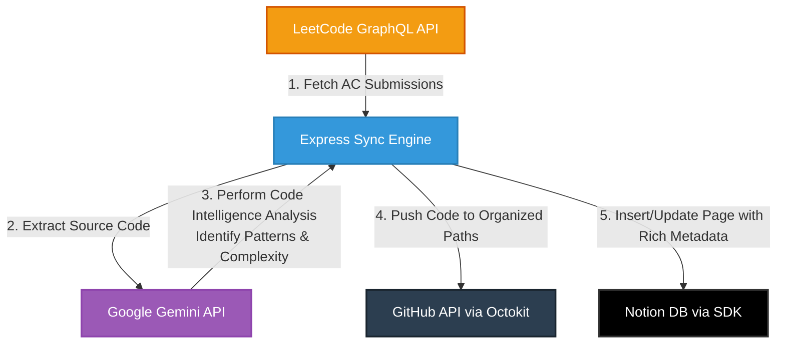

# LeetCode Auto-Sync

> An intelligent, local-first synchronization engine that automates developer workflows. It monitors, parses, and syncs your LeetCode solutions to Notion and GitHub, utilizing Google's Gemini Pro developer API for automated solution analysis, complexity estimations, and pattern categorization.

---

[](https://www.typescriptlang.org/)
[](https://react.dev/)
[](https://ai.google.dev/)
[](https://developers.notion.com/)
[](https://github.com/octokit/rest.js)

---

## 🚀 Overview

**LeetCode Auto-Sync** is a professional developer utility that bridges the gap between active problem solving and persistent knowledge management. Rather than manually copying code and writing explanations, this engine acts as a pipeline that:
1. Fetches your latest Accepted (AC) submissions directly via the **LeetCode GraphQL API**.
2. Leverages the **Google Gemini API** to run static code analysis, detecting algorithm design patterns (e.g., Backtracking, Sliding Window, Dynamic Programming), complexity classes ($O(N)$, $O(N \log N)$), and producing markdown documentation.
3. Automatically syncs code to your **GitHub repository** organized in structural folder hierarchies based on problem difficulty.
4. Generates rich, highly detailed logs and structures your learning in a **Notion Database** with pre-configured schemas.

---

## 📐 System Architecture

Below is the design flow showing how data moves across the APIs during a sync event:



---

## ✨ Key Features

- **LeetCode GraphQL Synchronization**: Pulls historical or recent Accepted submissions. Supports private and session-based GraphQL querying.
- **Google Gemini-Powered AI Insights**: Analyzes submitted code snippets. Automatically extracts:
  - **Algorithmic Patterns**: Categorizes problem-solving paradigms (e.g., Dynamic Programming, Two Pointers, BFS).
  - **Complexity Analysis**: Computes asymptotic time and space complexities.
  - **Approach Explanations**: Generates professional explanations for why a solution works.
- **GitHub Version Control Integration**: Structured pushing of solutions into folders sorted by difficulty (e.g., `LeetCode/Medium/two-sum.py`), checking for duplicates and updating changes incrementally.
- **Notion Schema Automation**: Connects with the Notion SDK to dynamically insert records. The server features an **Auto-Configure Schema** endpoint to automatically verify and deploy all required DB properties (Status, Platform, Pattern, Mastery, Complexity, etc.).
- **Modern Full-Stack Dev Experience**: Single-command development using Vite middleware + Express + Hot Module Reloading (HMR).

---

## 🛠️ Technology Stack

- **Frontend Core**: React 19, TypeScript, Tailwind CSS, Motion (framer-motion).
- **Backend Sync Engine**: Node.js, Express, Vite Dev Middleware (during development), TSX runner.
- **APIs & SDKs**:
  - Google Gemini Developer API (`@google/genai`)
  - Notion API (`@notionhq/client`)
  - GitHub Octokit API (`@octokit/rest`)

---

## ⚙️ Configuration & Prerequisites

### Prerequisites
- Node.js 18+ (LTS recommended)
- A Google Gemini API Key (obtained from the [Google AI Developer Portal](https://ai.google.dev/))
- A GitHub Personal Access Token (PAT) with repository permissions
- A Notion Integration Token and Database ID

### Environment Setup
Clone the configuration template and populate your local variables:

```bash
cp .env.example .env.local
```

Modify `.env.local` with your configuration details:

```env
# Google Gemini API key
GEMINI_API_KEY="YOUR_GEMINI_API_KEY"

# Base Application Host URL
APP_URL="http://localhost:3000"
```

---

## 🚀 Getting Started

### 1. Installation
Install all dependencies (including core developer libraries and compiler tools):

```bash
npm install
```

### 2. Development Mode
Run the development environment locally. The server is integrated into a unified Express endpoint serving the frontend via Vite dev middleware:

```bash
npm run dev
```

The application dashboard will be accessible at: `http://localhost:3000`

### 3. Production Build & Execution
Build the static frontend bundle and start the server in production mode:

```bash
# Build the optimized client bundle
npm run build

# Start the Node runtime server
npm run start
```

---

## 📦 Project Structure

```
├── .env.example             # Example environment file
├── server.ts                # Express backend & Sync Engine
├── vite.config.ts           # Bundler configuration
├── index.html               # Main entry HTML
├── tsconfig.json            # TypeScript configuration
├── package.json             # App dependencies & scripts
└── src/
    ├── main.tsx             # React DOM entry point
    ├── App.tsx              # Settings & Dashboard UI
    └── index.css            # Stylesheet & Tailwind imports
```

---

## 🌟 Google Cloud Deployment (Bonus Portfolio Feature)

To run this application as a serverless cron job (e.g., syncing your solves every night automatically), you can deploy it to **Google Cloud Platform (GCP)**:

1. **Build Container**: Package the application into a Docker container.
2. **Deploy to Google Cloud Run**: Deploy the container as a serverless service:
   ```bash
   gcloud run deploy leetcode-auto-sync --source . --platform managed
   ```
3. **Configure Google Cloud Scheduler**: Set up a daily cron trigger hitting `/api/sync` with your configuration payload, enabling fully automated, zero-maintenance background syncing.

---

## 📄 License

This project is licensed under the MIT License - see the LICENSE file for details.
